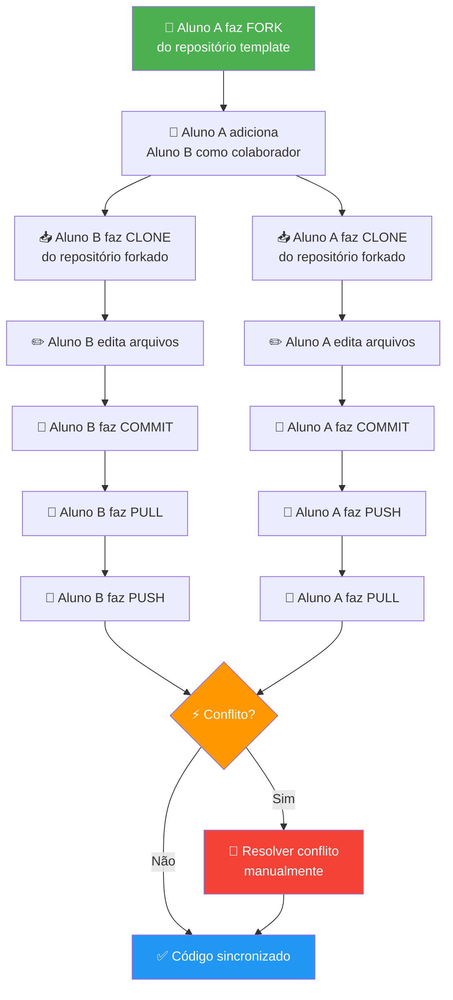
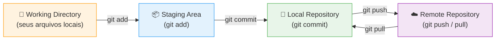
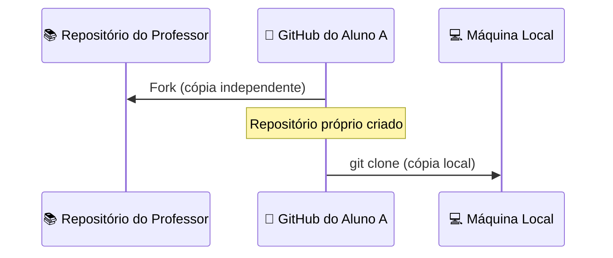
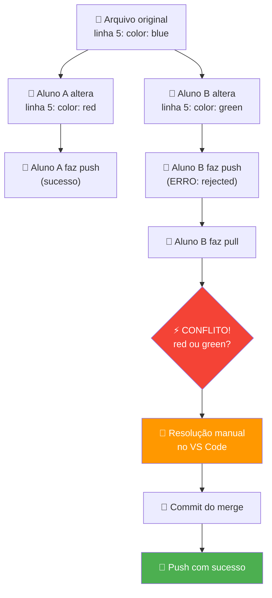

# � Laboratório: Gerenciamento de Código-Fonte com Git e GitHub

> **Disciplina:** Engenharia de Software  
> **Modalidade:** Prática em duplas (ou trios)  
> **Ferramentas:** Git, GitHub, Visual Studio Code (Windows)  

---

## 📁 Estrutura do Projeto

```
├── index.html      → Página principal
├── css/
│   └── style.css   → Estilos da página
├── js/
│   └── script.js   → Scripts de interatividade
├── img/
│   └── placeholder.png → Imagem placeholder
└── README.md       → Este arquivo
```

## 🛠️ Como Executar

Basta abrir o arquivo `index.html` no navegador, ou usar a extensão **Live Server** do VS Code:

1. Instale a extensão "Live Server" no VS Code.
2. Clique com o botão direito em `index.html`.
3. Selecione **"Open with Live Server"**.

## 👥 Dupla

| Papel | Nome | GitHub |
|---|---|---|
| Aluno A (Dono) | _Preencher_ | _@usuario_ |
| Aluno B (Colaborador) | _Preencher_ | _@usuario_ |

---

## 📋 Sumário

1. [Objetivos de Aprendizagem](#1-objetivos-de-aprendizagem)
2. [Pré-requisitos](#2-pré-requisitos)
3. [Contexto e Motivação](#3-contexto-e-motivação)
4. [Visão Geral do Fluxo de Trabalho](#4-visão-geral-do-fluxo-de-trabalho)
5. [Parte 1 — Preparação do Ambiente](#5-parte-1--preparação-do-ambiente)
6. [Parte 2 — Fork e Clone do Repositório](#6-parte-2--fork-e-clone-do-repositório)
7. [Parte 3 — Ciclo Básico: Edit → Commit → Push](#7-parte-3--ciclo-básico-edit--commit--push)
8. [Parte 4 — Colaboração: Pull e Sincronização](#8-parte-4--colaboração-pull-e-sincronização)
9. [Parte 5 — Resolução de Conflitos](#9-parte-5--resolução-de-conflitos)
10. [Troubleshooting — Problemas Comuns](#10-troubleshooting--problemas-comuns)
11. [Referências e Leitura Complementar](#11-referências-e-leitura-complementar)

---

## 1. Objetivos de Aprendizagem

Ao final desta atividade, você será capaz de:

| Nível (Bloom) | Objetivo |
|---|---|
| **Lembrar** | Identificar os comandos fundamentais do Git (`clone`, `commit`, `push`, `pull`) e suas finalidades. |
| **Compreender** | Explicar o fluxo de trabalho colaborativo baseado em fork e a diferença entre repositório local e remoto. |
| **Aplicar** | Executar o ciclo completo de versionamento: clonar um repositório, realizar alterações, registrar commits e sincronizar com o repositório remoto. |
| **Analisar** | Diagnosticar e resolver conflitos de merge que surgem no trabalho colaborativo. |

---

## 2. Pré-requisitos

Antes de iniciar, certifique-se de que você possui:

- [ ] **Conta no GitHub** — crie em [github.com](https://github.com) caso não tenha.
- [ ] **Git instalado** no Windows — baixe em [git-scm.com](https://git-scm.com/download/win).
- [ ] **Visual Studio Code** instalado — baixe em [code.visualstudio.com](https://code.visualstudio.com/).
- [ ] **Extensão GitLens** no VS Code (recomendado) — instale pela aba de extensões.
- [ ] **Navegador web** atualizado (Chrome, Firefox ou Edge).

### Verificação rápida do ambiente

Abra o **Terminal** do VS Code (`Ctrl + '`) e execute:

```bash
git --version
```

**Saída esperada** (a versão pode variar):

```
git version 2.47.1.windows.1
```

Se o comando não for reconhecido, revise a instalação do Git e certifique-se de que a opção **"Add Git to PATH"** foi marcada durante a instalação.

### Configuração inicial do Git (execute apenas uma vez)

```bash
git config --global user.name "Seu Nome Completo"
git config --global user.email "seu-email@exemplo.com"
```

> ⚠️ **Importante:** Use o **mesmo e-mail** que está cadastrado na sua conta GitHub.

---

## 3. Contexto e Motivação

Imagine que você e seu parceiro foram contratados para desenvolver a **landing page** de uma startup. O projeto já possui uma estrutura inicial em HTML, CSS e JavaScript, e vocês precisam trabalhar simultaneamente no mesmo repositório sem perder o trabalho um do outro.

Este cenário é extremamente comum na indústria de software. Segundo a pesquisa *Stack Overflow Developer Survey 2024*, mais de **93% dos desenvolvedores** utilizam Git como sistema de controle de versão. Dominar esse fluxo de trabalho não é opcional — é fundamental.

Nesta atividade, vocês vão vivenciar o ciclo real de desenvolvimento colaborativo, incluindo a situação inevitável de **conflitos de código**, e aprender a resolvê-los com segurança.

---

## 4. Visão Geral do Fluxo de Trabalho

O diagrama abaixo ilustra o fluxo completo que vocês seguirão nesta atividade:



### Áreas do Git que você vai utilizar



---

## 5. Parte 1 — Preparação do Ambiente

### 📌 Definição de papéis

Antes de começar, definam entre a dupla:

| Papel | Responsabilidade inicial |
|---|---|
| **Aluno A** (Dono do repositório) | Faz o **fork**, adiciona o parceiro como colaborador |
| **Aluno B** (Colaborador) | Aceita o convite e clona o repositório do Aluno A |

> 💡 Ambos terão permissão total de escrita no repositório ao final da configuração.

### Autenticação no GitHub via VS Code

Para que o `push` e `pull` funcionem corretamente, o VS Code precisa estar autenticado no GitHub.

1. Abra o VS Code.
2. Clique no ícone de **conta** (canto inferior esquerdo).
3. Selecione **"Sign in with GitHub"**.
4. Autorize no navegador quando solicitado.
5. Retorne ao VS Code.

**✅ Checkpoint:** No terminal do VS Code, execute:

```bash
git config --global credential.helper manager
```

Isso configura o gerenciador de credenciais do Windows para armazenar suas credenciais de forma segura.

---

## 6. Parte 2 — Fork e Clone do Repositório

### Passo 2.1 — Aluno A: Criar o Fork

1. Acesse o repositório template fornecido pelo professor:  
   `https://github.com/EngSoftwareFatecRL/01-Roteiro-SCM`

2. Clique no botão **"Fork"** (canto superior direito).

3. Na tela de criação do fork:
   - Mantenha o nome do repositório ou personalize (ex: `01_Roteiro-SCM_joao-maria`).
   - Marque a opção **"Copy the main branch only"**.
   - Clique em **"Create fork"**.

> 📸 **Evidência 1 — Aluno A:** Após criar o fork, tire um print da página inicial do repositório forkado no GitHub, exibindo o nome do repositório e o aviso *"forked from EngSoftwareFatecRL/01-Roteiro-SCM"*.



### Passo 2.2 — Aluno A: Adicionar Colaborador

1. No repositório forkado, vá em **Settings** → **Collaborators**.
2. Clique em **"Add people"**.
3. Pesquise pelo **nome de usuário GitHub** do Aluno B.
4. Clique em **"Add [nome] to this repository"**.

> O Aluno B receberá um e-mail de convite e também verá uma notificação no GitHub.

> 📸 **Evidência 2 — Aluno A:** Tire um print da página **Settings → Collaborators** mostrando o Aluno B listado como colaborador.

### Passo 2.3 — Aluno B: Aceitar o Convite

1. Acesse [github.com/notifications](https://github.com/notifications) ou verifique seu e-mail.
2. Aceite o convite de colaboração.

**✅ Checkpoint — Evidência 3 (ambos):** Ambos os alunos devem conseguir acessar o repositório em:  
`https://github.com/[AlunoA]/01_Roteiro-SCM_[nomes]`  
📸 Cada integrante tira um print do repositório aberto no browser logado com a sua própria conta.

### Passo 2.4 — Ambos: Clonar o Repositório

Cada aluno deve clonar **o repositório do Aluno A** (não o do professor).

1. No GitHub, clique no botão verde **"<> Code"** e copie a URL HTTPS.

2. No VS Code, abra o terminal (`Ctrl + '`) e execute:

```bash
cd C:\Users\SeuUsuario\Documents
git clone https://github.com/[AlunoA]/01_Roteiro-SCM_[nomes].git
```

3. Abra a pasta clonada no VS Code:

```bash
cd 01_Roteiro-SCM_[nomes]
code .
```

**✅ Checkpoint:** Verifique a estrutura do projeto:

```
01_Roteiro-SCM_[nomes]/
├── index.html
├── css/
│   └── style.css
├── js/
│   └── script.js
├── img/
│   └── placeholder.png
└── README.md
```

> Se a pasta estiver vazia ou o comando falhar, verifique se a URL está correta e se você tem acesso ao repositório.

> 📸 **Evidência 4 (ambos):** Tire um print do terminal mostrando a saída do `git clone` e a listagem dos arquivos clonados com `dir` (ou `ls`).

---

## 7. Parte 3 — Ciclo Básico: Edit → Commit → Push

Nesta etapa, **apenas o Aluno A** fará alterações. O Aluno B acompanha e observa.

### Passo 3.1 — Aluno A: Editar o arquivo `index.html`

Abra o arquivo `index.html` e localize a seção `<header>`. Altere o título da página:

```html
<!-- ANTES -->
<h1>Nome do Projeto</h1>

<!-- DEPOIS -->
<h1>DevLab - Soluções Digitais</h1>
```

Salve o arquivo (`Ctrl + S`).

### Passo 3.2 — Aluno A: Verificar o status das alterações

No terminal do VS Code:

```bash
git status
```

**Saída esperada:**

```
On branch main
Changes not staged for commit:
  (use "git add <file>..." to update what will be committed)
        modified:   index.html
```

> 📖 **O que significa?** O Git detectou que o arquivo foi modificado, mas ainda **não está na staging area** (área de preparação para o commit).

### Passo 3.3 — Aluno A: Adicionar à Staging Area

```bash
git add index.html
```

Verifique novamente:

```bash
git status
```

**Saída esperada:**

```
Changes to be committed:
  (use "git restore --staged <file>..." to unstage)
        modified:   index.html
```

> 📖 Agora o arquivo está na **staging area**, pronto para ser registrado no histórico.

### Passo 3.4 — Aluno A: Criar o Commit

```bash
git commit -m "Atualiza título da landing page para DevLab"
```

**Saída esperada:**

```
[main abc1234] Atualiza título da landing page para DevLab
 1 file changed, 1 insertion(+), 1 deletion(-)
```

> 💡 **Boas práticas para mensagens de commit:**
> - Use o **imperativo** (ex: "Adiciona", "Corrige", "Remove") — não "Adicionei" ou "Adicionando".
> - Seja **descritivo e conciso**: a mensagem deve explicar **o quê** foi feito.
> - Exemplos bons: `Adiciona formulário de contato`, `Corrige alinhamento do menu mobile`.
> - Exemplos ruins: `update`, `fix`, `alterações`, `commit 1`.

### Passo 3.5 — Aluno A: Enviar para o GitHub (Push)

```bash
git push origin main
```

**Saída esperada:**

```
Enumerating objects: 5, done.
...
To https://github.com/[AlunoA]/01_Roteiro-SCM_[nomes].git
   def4567..abc1234  main -> main
```

**✅ Checkpoint — Evidência 5 (Aluno A):** Acesse o repositório no GitHub pelo navegador e verifique:
- O commit aparece no histórico?
- O arquivo `index.html` reflete a alteração?  
📸 Tire um print da página de commits do repositório no GitHub, mostrando o commit recém-criado com o seu nome de usuário.

### Passo 3.6 — Aluno B: Receber as alterações (Pull)

Agora o Aluno B vai trazer as alterações feitas pelo Aluno A para sua máquina local.

No terminal do VS Code **do Aluno B**:

```bash
git pull origin main
```

**Saída esperada:**

```
remote: Enumerating objects: 5, done.
...
Updating def4567..abc1234
Fast-forward
 index.html | 2 +-
 1 file changed, 1 insertion(+), 1 deletion(-)
```

**✅ Checkpoint — Evidência 6 (Aluno B):** O Aluno B deve abrir o `index.html` e confirmar que o título agora é `DevLab - Soluções Digitais`.  
📸 Tire um print do terminal mostrando a saída bem-sucedida do `git pull` e o arquivo `index.html` aberto no VS Code com o título atualizado.

---

### 🔄 Pratique: Agora inverta os papéis!

Agora é a vez do **Aluno B** fazer uma alteração e o **Aluno A** sincronizar.

**Tarefa do Aluno B:**

1. Abra o arquivo `css/style.css`.
2. Adicione ou altere a cor de fundo do `body`:

```css
body {
    background-color: #f0f4f8;
    font-family: 'Segoe UI', Tahoma, Geneva, Verdana, sans-serif;
}
```

3. Execute a sequência completa:

```bash
git add css/style.css
git commit -m "Define cor de fundo e fonte padrão do body"
git push origin main
```

**Tarefa do Aluno A:**

```bash
git pull origin main
```

**✅ Checkpoint — Evidência 7 (Aluno B):** Ambos devem ter as mesmas alterações nos arquivos `index.html` e `css/style.css`.  
📸 Aluno B: tire um print do terminal com a saída do `git push` bem-sucedido e a página de commits no GitHub mostrando o commit do Aluno B.

---

## 8. Parte 4 — Colaboração: Pull e Sincronização

Agora vocês vão experimentar o que acontece quando **ambos fazem alterações em arquivos diferentes** ao mesmo tempo.

### Cenário: Trabalho paralelo sem conflito

**Aluno A** vai editar `js/script.js` e **Aluno B** vai editar `index.html`. Como são **arquivos diferentes**, o Git conseguirá mesclar automaticamente.

#### Aluno A — Editar `js/script.js`

Adicione o seguinte código:

```javascript
// Mensagem de boas-vindas no console
document.addEventListener('DOMContentLoaded', function() {
    console.log('DevLab - Landing Page carregada com sucesso!');
});
```

Faça o commit e push:

```bash
git add js/script.js
git commit -m "Adiciona mensagem de log ao carregar a página"
git push origin main
```

#### Aluno B — Editar `index.html`

**Antes de fazer push**, adicione um parágrafo de descrição no `index.html`:

```html
<p class="descricao">Transformando ideias em soluções digitais inovadoras.</p>
```

Faça o commit:

```bash
git add index.html
git commit -m "Adiciona parágrafo de descrição na landing page"
```

Agora tente fazer o push:

```bash
git push origin main
```

**⚠️ Resultado esperado — ERRO:**

```
To https://github.com/[AlunoA]/01_Roteiro-SCM_[nomes].git
 ! [rejected]        main -> main (fetch first)
error: failed to push some refs to '...'
hint: Updates were rejected because the remote contains work that you do not
hint: have locally.
```

> 📖 **O que aconteceu?** O Aluno A fez um push antes do Aluno B. O repositório remoto está à frente do repositório local do Aluno B. O Git **se recusa a sobrescrever** as alterações do Aluno A.

#### Aluno B — Resolver com Pull antes do Push

```bash
git pull origin main
```

**Saída esperada:**

```
Merge made by the 'ort' strategy.
 js/script.js | 4 ++++
 1 file changed, 4 insertions(+)
```

Como as alterações foram em **arquivos diferentes**, o Git fez o merge automaticamente!

Agora complete o push:

```bash
git push origin main
```

**✅ Checkpoint — Evidência 8 (ambos):** Ambos fazem `git pull` e verificam que **ambas** as alterações estão presentes:
- `index.html` com o parágrafo de descrição
- `js/script.js` com a mensagem de console

📸 Tire um print da página de commits no GitHub mostrando os dois commits (um de cada aluno) e o commit de merge automático.

#### Aluno A — Sincronizar

```bash
git pull origin main
```

---

## 9. Parte 5 — Resolução de Conflitos

Esta é a parte mais importante da atividade. Vocês vão **provocar intencionalmente** um conflito para aprender a resolvê-lo.

### O que é um conflito?

Um conflito ocorre quando **dois desenvolvedores alteram a mesma linha do mesmo arquivo** e tentam mesclar as alterações. O Git não consegue decidir sozinho qual versão manter.



### Passo 5.1 — Provocar o Conflito

> ⚠️ **ATENÇÃO:** Ambos devem começar sincronizados. Executem `git pull origin main` antes de iniciar.

#### Aluno A — Alterar `css/style.css`

Localize (ou adicione) a regra do `h1` e defina:

```css
h1 {
    color: #e74c3c;
    font-size: 2.5rem;
    text-align: center;
}
```

Faça commit e push:

```bash
git add css/style.css
git commit -m "Define estilo do h1 com cor vermelha"
git push origin main
```

#### Aluno B — Alterar `css/style.css` (MESMA regra)

**Sem fazer pull**, altere a mesma regra do `h1`:

```css
h1 {
    color: #2ecc71;
    font-size: 3rem;
    text-align: left;
}
```

Faça commit:

```bash
git add css/style.css
git commit -m "Define estilo do h1 com cor verde"
```

Tente fazer push:

```bash
git push origin main
```

**⚠️ Resultado esperado — ERRO (rejected).**

### Passo 5.2 — Identificar o Conflito

Aluno B, execute:

```bash
git pull origin main
```

**Saída esperada:**

```
Auto-merging css/style.css
CONFLICT (content): Merge conflict in css/style.css
Automatic merge failed; fix conflicts and then commit the result.
```

### Passo 5.3 — Entender os Marcadores de Conflito

Abra o arquivo `css/style.css` no VS Code. Você verá algo assim:

```css
h1 {
<<<<<<< HEAD
    color: #2ecc71;
    font-size: 3rem;
    text-align: left;
=======
    color: #e74c3c;
    font-size: 2.5rem;
    text-align: center;
>>>>>>> abc1234
}
```

**Entendendo os marcadores:**

| Marcador | Significado |
|---|---|
| `<<<<<<< HEAD` | Início das **suas** alterações locais (Aluno B) |
| `=======` | Separador entre as duas versões |
| `>>>>>>> abc1234` | Fim das alterações do **repositório remoto** (Aluno A) |

### Passo 5.4 — Resolver o Conflito no VS Code

O VS Code oferece **botões de ação** acima dos marcadores de conflito:

- **Accept Current Change** — mantém apenas a sua versão (Aluno B).
- **Accept Incoming Change** — mantém apenas a versão remota (Aluno A).
- **Accept Both Changes** — mantém ambas (pode precisar de ajuste manual).

> 🎯 **Para esta atividade**, vocês devem resolver o conflito **conversando entre si** e chegando a um consenso. Por exemplo, podem decidir:

```css
h1 {
    color: #2ecc71;       /* cor do Aluno B */
    font-size: 2.5rem;    /* tamanho do Aluno A */
    text-align: center;   /* alinhamento do Aluno A */
}
```

**Importante:** Após resolver, **remova completamente** os marcadores `<<<<<<<`, `=======` e `>>>>>>>`.

### Passo 5.5 — Finalizar a Resolução

Após editar e salvar o arquivo corretamente:

```bash
git add css/style.css
git commit -m "Resolve conflito no estilo do h1 (consenso da dupla)"
git push origin main
```

#### Aluno A — Sincronizar

```bash
git pull origin main
```

**✅ Checkpoint Final da Parte 5 — Evidência 9 (ambos):**
- [ ] O arquivo `css/style.css` **não contém** marcadores de conflito.
- [ ] Ambos os alunos possuem a **mesma versão** do arquivo.
- [ ] O histórico de commits no GitHub mostra o commit de merge.
- [ ] Abra o `index.html` no navegador e verifique se o estilo está aplicado corretamente.

📸 **Evidência 9a (Aluno B):** Print da tela do VS Code mostrando o arquivo `css/style.css` **após a resolução**, sem marcadores de conflito.  
📸 **Evidência 9b (ambos):** Print do histórico completo de commits no GitHub (`Insights → Network` ou a aba *Commits*), mostrando os commits de ambos os integrantes e o commit de resolução do conflito.  
📸 **Evidência 9c (ambos):** Print do `index.html` aberto no navegador com o estilo final aplicado.

---

## 10. Troubleshooting — Problemas Comuns

### ❌ `fatal: not a git repository`

**Causa:** Você não está dentro da pasta do projeto clonado.

**Solução:**

```bash
cd C:\Users\SeuUsuario\Documents\01_Roteiro-SCM_[nomes]
```

---

### ❌ `error: failed to push some refs`

**Causa:** O repositório remoto tem commits que você não possui localmente.

**Solução:**

```bash
git pull origin main
# Resolva conflitos se houver
git push origin main
```

---

### ❌ `Permission denied (publickey)` ou erro de autenticação

**Causa:** Credenciais não configuradas ou expiradas.

**Solução:**

1. Verifique se está usando HTTPS (não SSH):
   ```bash
   git remote -v
   ```
   A URL deve começar com `https://`.

2. Reconfigure o credential helper:
   ```bash
   git config --global credential.helper manager
   ```

3. Faça um push e autentique novamente pelo navegador.

---

### ❌ Marcadores de conflito no código após resolução

**Causa:** Os marcadores `<<<<<<<`, `=======`, `>>>>>>>` não foram removidos.

**Solução:** Abra o arquivo, remova todos os marcadores manualmente, salve e faça:

```bash
git add [arquivo]
git commit -m "Resolve conflito em [arquivo]"
```

---

### ❌ `Your branch is ahead of 'origin/main' by X commits`

**Causa:** Você tem commits locais que ainda não foram enviados.

**Solução:**

```bash
git push origin main
```

---

### ❌ Quero desfazer o último commit (ainda não fiz push)

```bash
git reset --soft HEAD~1
```

Isso desfaz o commit mas **mantém suas alterações** na staging area.

---

## 11. Referências e Leitura Complementar

- **Pro Git Book** (gratuito, em português): [git-scm.com/book/pt-br/v2](https://git-scm.com/book/pt-br/v2)
- **GitHub Docs — Quickstart**: [docs.github.com/pt/get-started/quickstart](https://docs.github.com/pt/get-started/quickstart)
- **Visualizing Git**: [git-school.github.io/visualizing-git](https://git-school.github.io/visualizing-git/) — ferramenta interativa para visualizar operações Git.
- **Learn Git Branching**: [learngitbranching.js.org](https://learngitbranching.js.org/?locale=pt_BR) — tutorial interativo gamificado.
- **Git Cheat Sheet (GitHub)**: [education.github.com/git-cheat-sheet-education.pdf](https://education.github.com/git-cheat-sheet-education.pdf)

---

## 📎 Resumo de Comandos

| Comando | Finalidade |
|---|---|
| `git clone <url>` | Copia o repositório remoto para a máquina local |
| `git status` | Mostra o estado atual dos arquivos |
| `git add <arquivo>` | Adiciona alterações à staging area |
| `git commit -m "msg"` | Registra as alterações no histórico local |
| `git push origin main` | Envia commits locais para o repositório remoto |
| `git pull origin main` | Baixa e mescla alterações do repositório remoto |
| `git log --oneline` | Exibe o histórico de commits de forma compacta |
| `git diff` | Mostra as diferenças entre arquivos modificados |

---

## 12. Evidências a serem entregues

Cada integrante deve entregar individualmente um documento (**.docx** ou **.pdf**) contendo as evidências abaixo. As capturas de tela devem ser **legíveis**, mostrar **data/hora do sistema** (deixe a barra de tarefas visível) e o **nome de usuário GitHub** conectado (exibido no canto superior direito do GitHub).

---

### 📋 Lista de evidências obrigatórias

| # | Quem coleta | O que capturar |
|---|---|---|
| **1** | Aluno A | Página inicial do repositório forkado no GitHub, exibindo o aviso *"forked from EngSoftwareFatecRL/01-Roteiro-SCM"* |
| **2** | Aluno A | Página **Settings → Collaborators** com o Aluno B listado como colaborador |
| **3** | Ambos | Repositório aberto no browser logado com a conta própria de cada integrante |
| **4** | Ambos | Terminal com a saída do `git clone` seguida de `dir` (ou `ls`) listando os arquivos clonados |
| **5** | Aluno A | Página de commits do repositório no GitHub com o commit do Passo 3.4 visível e o nome do autor |
| **6** | Aluno B | Terminal com a saída do `git pull` (Passo 3.6) e o `index.html` aberto no VS Code com o título `DevLab - Soluções Digitais` |
| **7** | Aluno B | Terminal com a saída do `git push` bem-sucedido após o ciclo de inversão de papéis |
| **8** | Ambos | Página de commits no GitHub mostrando commits de ambos os integrantes e o commit de merge automático (Parte 4) |
| **9a** | Aluno B | VS Code exibindo `css/style.css` **após a resolução do conflito**, sem marcadores `<<<<<<<` |
| **9b** | Ambos | Histórico de commits no GitHub (aba *Commits* ou *Insights → Network*) com o commit de resolução do conflito de ambos os integrantes |
| **9c** | Ambos | `index.html` aberto no navegador com o estilo final aplicado corretamente |

---

### 📝 Sobre o documento de entrega

- **Formato:** `.docx` ou `.pdf`
- **Nome do arquivo:** `SCM_[NomeCompleto]_RA[seu-RA].pdf` (ex: `SCM_JoaoSilva_RA2024001.pdf`)
- **Conteúdo obrigatório:**
  - Cabeçalho com: nome completo, RA, nome do parceiro e URL do repositório
  - As 9 evidências listadas acima, **numeradas e identificadas**, com legenda indicando o que está sendo mostrado
  - Breve resposta (2–4 linhas) para cada uma das perguntas reflexivas abaixo:

### 💬 Perguntas reflexivas (responder no documento)

1. Qual é a diferença entre `git add` e `git commit`? Por que essas duas etapas existem separadas?
2. O que acontece no repositório local quando você executa `git pull`? O que pode dar errado?
3. Em qual situação o Git **não consegue** fazer o merge automaticamente? Como você resolveu o conflito nesta atividade?

---

